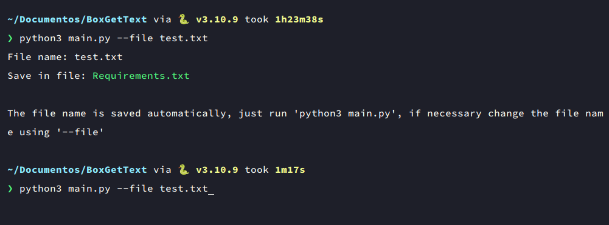

# BoxGetText
BoxGetText is a program that extracts text from images you select it, developed in Python.

## Screenshot


## Prerequisites
BoxGetText requires the following:

* Python3
* xdotool
* ImageMagick

Please use your distribution's package manager to install these packages.

### Note
This program only works on Linux due to the required packages.

## Installation
```
git clone https://github.com/nozmer/BoxGetText.git
cd BoxGetText
pip install -r requirements.txt
```

## Examples
```
python3 main.py --file test.txt
```
